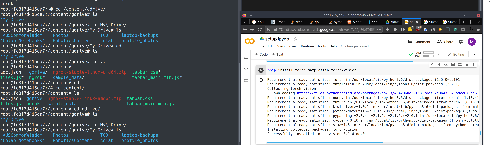

# Google Colab Management


# Idea 
Run a command in terminal to open a shell terminal in colab.
And whatever git repo you pass or local jupyter notebook.



# Done 

Server api:
ID is a hash of the user email.

Post an ngrok tunnel:

```
curl -d '{"ID":"test","User":"root","URL":"0.tcp.ngrok.io","Port":"16942","RawURL":"root@tcp://0.tcp.ngrok.io:16988"}' -H "Content-Type: application/json" -X POST http://localhost:8443/google-colab-manager/api/tunnel
```

To Get a tunnel go to pmolloy.com:16988/google-colab-manager/api/tunnels/{id}

```
curl -X GET http://localhost:8443/google-colab-manager/api/tunnels/test
```
# Not Done

Client script which takes in username.

Asks for ngrok api token.
Give link to https://ngrok.com/
Copy an auth token from https://dashboard.ngrok.com/get-started/setup here.
Ask for ssh password user wants to use.

Gives setup.ipynb jupyter notebook  to put in google colab.

Then pass back grok ssh port through pmolloy.com/auto-colab.

Client then picks up this ngrok port. 
Client Keeps NGrok connection alive somehow.


Load google drive file system with auth token.
Ask user to enter google auth token in colab/client maybe?
We save the auth token in adc.json and then use it to refresh auth from now on.
After the first use the user does not have to use 
This might be able to be done over ssh or via pmolloy.com/auto-colab with with the tokenencypted with public private keys. 


From then on run Client in terminal.

It will start setup.ipynb quietly in the browser. Run a startup script for you in the shell. Then open the desired jupyter notebook in the browser. and leave a terminal shell open.


# Stuff I'm Using + Inspiration.


## An easy way to get a shell. 

https://ngrok.com/

## Automated Google Drive mounting:
https://stackoverflow.com/questions/57772453/login-on-colab-with-gcloud-without-service-account

## A pretty cool CLI for google colab that Akshay Ashok made:
https://towardsdatascience.com/heres-how-i-made-a-cli-tool-to-work-with-google-colab-notebooks-7678a88ca662


